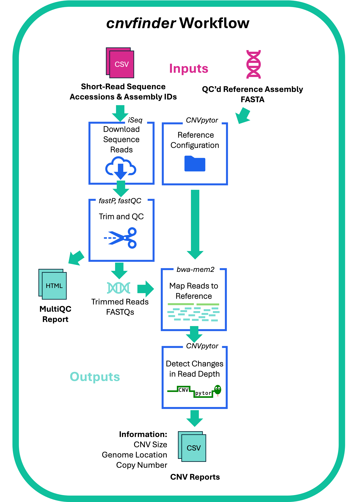

# cnvfinder

## Introduction

**cnvfinder** is a bioinformatics pipeline for detecting copy number variants (CNVs) in bacterial genomes from short-read sequencing data. This has been written in Nextflow using the nf-core template. Given paired reads and a matching genome assembly for each sample, the pipeline:

1. **Download reads and runs QC** – by default, downloads reads from SRA/ENA (via iSeq), trims with fastp, runs FastQC and collates these into a MultiQC report. Reference assemblies are **not** downloaded by the pipeline and must be obtained separately (see Usage below)
3. **Builds a reference configuration** – generates a GC file and a CNVpytor-compatible configuration file for each assembly
4. **Maps reads to the reference** – indexes the assembly, maps trimmed reads, converts SAM to BAM, and assesses mapping quality
5. **Calls copy number variants** – partitions the genome into bins (default 100 bp) and calls CNVs with [CNVpytor](https://github.com/abyzovlab/CNVpytor)


<p align="center">
  
</p>

## Usage

> [!NOTE]
> If you are new to Nextflow and nf-core, please refer to [this page](https://nf-co.re/docs/get_started/environment_setup/overview) on how to set up Nextflow. Then ensure apptainer, Singularity or docker are installed and running.
>

### Git clone this repository and enter cnvfinder directory to run analyses.
```
git clone https://github.com/Sarah-Cameron/cnvfinder.git 
cd cnvfinder
```

### Input data

The pipeline takes **matched read and assembly pairs** via a CSV file (passed with `--accessions`), rather than a standard samplesheet. It has two columns: read name and assembly name. Each line enters the pipeline and will be that read set mapped against that assembly. You can specify the same read set mapped to multiple assemblies and vice versa:

```csv
ERR304775,SAMEA1920853
ERR304775,my_own_assembly
```

Assemblies are not downloaded by the pipeline itself, so you can choose what to use as your reference. We choose to map to the corresponding short-read based reference from [AllTheBacteria](https://www.allthebacteria.org) this can be messy but because the short-read reference will usually miss most genome amplifications, using this read depth based method allow us to spot these. If you use a closed genome that has been assemblied with long reads these may be captured by the assembly and therefore won't give rise to change in read depth and so this method wouldn't necessarily be suitable. To download the AllTheBacteria assemblies first use:

```bash
sh bin/download_atb.sh biosample_name_list.txt 
```

This pulls matching assemblies from [AllTheBacteria](https://www.allthebacteria.org) into an `assemblies/` folder, named `<assembly_name>.fa` to match the second column of `accessions.csv`.

How you fill in the **read name** column (and where reads come from) depends on which of the two paths below you're using.

#### Path A: Using SRA/ENA accessions (default)

By default, the pipeline downloads reads for you. Use SRA Run accessions as the `read_name` column in `accessions.csv`. Reads are downloaded automatically (via iSeq) when you run the pipeline — no extra step needed beyond having downloaded the assemblies as above.

> [!IMPORTANT]
> If your cluster's compute nodes can't reach the internet, this in-run download won't work. Pre-download reads and assemblies together ahead of time instead, with `bin/both_downloads.sh`, then follow Path B below.

> [!TIP]
> A ready-made file with the right columns (`Run`, `BioSample`) can be pulled straight from [NCBI/SRA](https://www.ncbi.nlm.nih.gov/sra): filter for the genomes you want, then use *Send to → File → RunInfo*. Then you can easily copy and paste the SRA accession IDs column and corresponding BioSample ID column for that read set into a new .csv file.

#### Path B: Using your own reads

If you have your own read files (private data, or pre-downloaded for HPC), place them in a folder called `reads/`, named `<read_name>.fastq.gz`. Use those same names as the `read_name` column in `accessions.csv`, and run the pipeline with `--skip_download true` so it uses your local files instead of trying to download reads itself.

```csv
my_own_reads,my_own_assembly
my_own_reads2,my_own_assembly2
```

### Running the pipeline

```bash
nextflow run main.nf \
   -profile <docker/apptainer/slurm> \
   --accessions accessions.csv \
   --outdir <OUTDIR>

### Test example
# Download AllTheBacteria assembly
sh bin/download_atb.sh test.txt
# Run the example on Bordetella pertussis strain UK54 
nextflow run main.nf -profile docker --accessions test.csv --species 'Bordetella pertussis'


### If running on Mac Terminal (ARM) with docker
nextflow run main.nf --accessions test.csv -profile docker,emulate_amd64 --species 'Bordetella pertussis'
```

### Parameters

| Parameter        | Description                                                                 | Default                |
| ----------------- | ---------------------------------------------------------------------------- | ----------------------- |
| `--accessions`    | CSV file mapping read names to assembly names (see format above)             | *required*              |
| `--profile`       | Execution profile: `docker`, `apptainer`, or `slurm`                        | *required*              |
| `--fasta`         | File extension of assemblies (e.g. `.fasta`, `.fa`, `.fna`)                  | `fa`                        |
| `--skip_download` | Skip automatic download of reads/assemblies (use for private/local data)     | `false`                 |
| `--bin_size`      | Read-depth bin size for CNV calling. Must be a multiple of 100.              | `100`                   |
| `--species`       | Target species (string) - only needed for config file                                                     | `Klebsiella pneumoniae` |


## Pipeline output

Results are organised into the following subfolders of `--outdir`:

| Folder                       | Contents                                                            |
| ------------------------------ | ---------------------------------------------------------------------- |
| `calls/`                     | `.tsv` files of predicted CNVs, output by CNVpytor                  |
| `configs/`                   | CNVpytor genome configuration file (`.py`) for each strain          |
| `GC_files/`                  | CNVpytor `.pytor` files used in reference configuration             |
| `metadata/`                  | Per-strain metadata `.tsv` files from SRA/ENA download               |
| `Pytors/`                    | CNVpytor `.py` reference files                                       |
| `QC/`                        | FastQC logs/outputs, plus `samtools depth`/coverage files            |
| `Reads/`                     | Raw reads downloaded from SRA/ENA                                    |
| `Results/multiQC/`           | MultiQC summary report (`.html`)                                     |
| `Results/pipeline_info/`     | Pipeline execution report and software versions                      |
| `SAMs/`                      | SAM files from read mapping                                           |
| `Trimmed_reads/`             | Trimmed FASTQ read files                                              |

`calls/` is where you will find a tsv file for each sample with CNVpytor calls. If using a short read based reference this will include a lot of calls detecting changes in read depth from reasons other than just CNVs. e.g. IS elements, rRNA genes, prophage activation, multi-copy genes not in tandem. 

## Credits

cnvfinder was originally written by Sarah Cameron.

## Contributions and Support

If you would like to contribute to this pipeline, please see the [contributing guidelines](docs/CONTRIBUTING.md).

## Citations

An extensive list of references for the tools used by the pipeline can be found in [`CITATIONS.md`](CITATIONS.md).

You can cite the `nf-core` publication as follows:

> **The nf-core framework for community-curated bioinformatics pipelines.**
> Philip Ewels, Alexander Peltzer, Sven Fillinger, Harshil Patel, Johannes Alneberg, Andreas Wilm, Maxime Ulysse Garcia, Paolo Di Tommaso & Sven Nahnsen.
> *Nat Biotechnol.* 2020 Feb 13. doi: [10.1038/s41587-020-0439-x](https://dx.doi.org/10.1038/s41587-020-0439-x).
