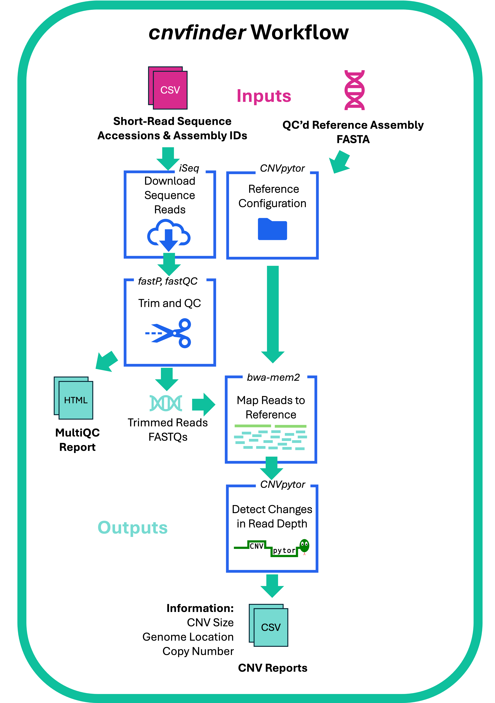
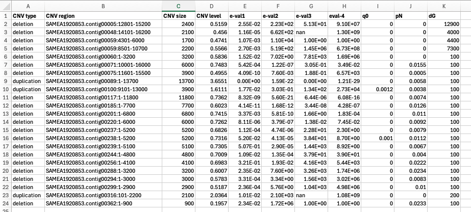

# cnvfinder

[](https://www.nextflow.io/)
[](https://www.docker.com/)
[](https://sylabs.io/docs/)
[](https://www.schedmd.com)


## Introduction

**cnvfinder** is a bioinformatics pipeline for detecting copy number variants (CNVs) in bacterial genomes from short-read sequencing data. This has been written in Nextflow using the nf-core template. From a csv of SRA accession IDs and matching  BioSample IDs, the pipeline:

1. **Download reads and runs QC** – by default, downloads reads from SRA/ENA (via [iSeq](https://github.com/BioOmics/iSeq)) and assemblies from [AllTheBacteria](https://www.allthebacteria.org), trims reads with [fastp](https://github.com/opengene/fastp), runs [FastQC](https://github.com/s-andrews/fastqc) and collates these into a [MultiQC](https://github.com/multiqc/multiqc) report. 
3. **Builds a reference configuration** – generates a GC file and a [CNVpytor](https://github.com/abyzovlab/CNVpytor)-compatible configuration file for each assembly
4. **Maps reads to the reference** – indexes the assembly, maps trimmed reads ([bwa-mem2](https://github.com/bwa-mem2/bwa-mem2), converts SAM to BAM, and assesses mapping quality ([samtools](https://github.com/samtools/samtools))
5. **Calls copy number variants** – partitions the genome into bins (default 100 bp) and calls CNVs with [CNVpytor](https://github.com/abyzovlab/CNVpytor)


<p align="center">
  
</p>

## Usage

> [!NOTE]
> If you are new to Nextflow and nf-core, please refer to [this page](https://nf-co.re/docs/get_started/environment_setup/overview) on how to set up Nextflow. Then ensure apptainer, Singularity or docker are installed and running.
>

### Git clone this repository and enter cnvfinder directory to run analyses.
```
git clone https://github.com/Sarah-Cameron/cnvfinder.git 
cd cnvfinder
```

### Input data

The pipeline takes **matched read and assembly pairs** via a CSV file (passed with `--accessions`), rather than a standard samplesheet. It has two columns with **NO** header: read name (SRA accession ID) and assembly name (BioSample ID). Each line enters the pipeline and will be that read set mapped against that assembly. You can specify the same read set mapped to multiple assemblies and vice versa:

```csv
ERR304775,SAMEA1920853
ERR304775,SAMN0000001
```

We choose to align read sets to the corresponding short-read based assembly of the reads from [AllTheBacteria](https://www.allthebacteria.org). Short-read only based assemblies will not incorporate most genome amplifications so when the reads are aligned there will be a change in read depth and allow the use of this method. Long read based references can capture duplications in the assembly and this won't give a change in read depth when reads are mapped. 

How you fill in the csv columns depends on which of the two paths below you're using.

#### Path A: Using SRA/ENA accessions and BioSample accession (default)

By default, the pipeline downloads and assemblies reads for you. Use SRA Run accessions as the `read_name` column in `accessions.csv`. Reads and assemblies are downloaded automatically when you run the pipeline — no extra step needed. 

> [!IMPORTANT]
> If your cluster's compute nodes can't reach the internet, this in-run download won't work. Pre-download reads and assemblies together ahead of time instead, with `bin/both_downloads.sh`, then follow Path B below.

> [!TIP]
> A ready-made file with the right columns (`Run`, `BioSample`) can be pulled straight from [NCBI/SRA](https://www.ncbi.nlm.nih.gov/sra): filter for the genomes you want, then use *Send to → File → RunInfo*. Then you can easily copy and paste the SRA accession IDs column and corresponding BioSample ID column for that read set into a new .csv file.

#### Path B: Using your own reads

If you have your own read files (private data, or pre-downloaded for HPC), place them **compressed** in a folder called `reads/`, named `<read_name>.fastq.gz`. Place assemblies **uncompressed** in `/assemblies`, named `<assembly_name>.fa`. If ending is a `.fasta` use `--fasta fasta` when running the pipeline. Use those same names as the `read_name` and `assembly_name` columns in `accessions.csv`, and run the pipeline with `--skip_download true` so it uses your local files instead of trying to download reads itself.

```csv
my_own_reads,my_own_assembly
my_own_reads2,my_own_assembly2
```

### Running the pipeline

```bash
nextflow run main.nf \
   -profile <docker/apptainer/slurm> \
   --accessions accessions.csv \
   --outdir <OUTDIR>

### Test example
# Run the example on Bordetella pertussis strain UK54 
nextflow run main.nf -profile docker --accessions test.csv --species 'Bordetella pertussis'

# Run with your own reads and assemblies
nextflow run main.nf -profile docker --accessions my_own_reads.csv --skip_download true --fasta fna --species 'Campylobacter jejuni'

### If running on Mac Terminal (ARM) with docker
nextflow run main.nf --accessions test.csv -profile docker,emulate_amd64 --species 'Bordetella pertussis'
```

### Parameters

| Parameter        | Description                                                                 | Default                |
| ----------------- | ---------------------------------------------------------------------------- | ----------------------- |
| `--accessions`    | CSV file mapping read names to assembly names (see format above)             | *required*              |
| `--profile`       | Execution profile: `docker`, `apptainer`, or `slurm`                        | *required*              |
| `--outdir`	    | Output directory for results						  | `results/`	            |
| `--fasta`         | File extension of assemblies (e.g. `.fasta`, `.fa`, `.fna`)                  | `fa`                        |
| `--skip_download` | Skip automatic download of reads/assemblies (use for private/local data)     | `false`                 |
| `--bin_size`      | Read-depth bin size for CNV calling. Must be a multiple of 100.              | `100`                   |
| `--species`       | Target species (string) - only needed for config file                                                     | `Klebsiella pneumoniae` |


## Pipeline output

Outputs are organised into the following folders:

| Folder                       | Contents                                                            |
| ------------------------------ | ---------------------------------------------------------------------- |
| `assemblies/`                | Genome assemblies downloaded from AllTheBacteria                    |
| `GC_files/`                  | CNVpytor `.pytor` files used in reference configuration             |
| `reads/`                     | Raw reads downloaded from SRA/ENA                                    |
| `results/calls/`                     | `.tsv` files of predicted CNVs, output by CNVpytor                  |
| `results/configs/`                   | CNVpytor genome configuration file (`.py`) for each strain          |
| `results/metadata/`                  | Per-strain metadata `.tsv` files from SRA/ENA download               |
| `results/pytors/`                    | CNVpytor `.py` reference files                                       |
| `results/QC/`                        | FastQC logs/outputs, plus `samtools depth`/coverage files            |
| `results/multiQC/`           | MultiQC summary report (`.html`)                                     |
| `results/pipeline_info/`     | Pipeline execution report and software versions                      |
| `results/SAMs/`                      | SAM files from read mapping                                           |
| `results/trimmed_reads/`             | Trimmed FASTQ read files                                              |

`calls/` is where you will find a tsv file for each sample with CNVpytor calls as detailed [here](https://github.com/abyzovlab/CNVpytor/blob/master/GettingStarted.md).

"Columns are as follows: 

**CNV type:** "deletion" or "duplication", \
**CNV region:** (chr:start-end), \
**CNV size:** (bp), \
**CNV level:** read depth normalised to 1, \
**e-val1:** e-value (p-value multiplied by genome size divided by the bin size) calculated using t-test statistics between RD statistics in the region and global, \
**e-val2:** e-value (p-value multiplied by genome size divided by the bin size) from the probability of RD values within the region to be the tails of a gaussian distribution of binned RD, \
**e-val3:** same as e-val1 but for the middle of the CNV, \
**e-val4:** same as e-val2 but for the middle of the CNV, \
**q0:** fraction of reads mapped with q0 quality in call region, \
**pN:** fraction of reference genome gaps (Ns) in call region, \
**dG:** distance from closest large (>100bp) gap in reference genome" 

<p align="center">
  
</p>

## Credits

cnvfinder was originally written by Sarah Cameron.

## Contributions and Support

If you would like to contribute to this pipeline, please see the [contributing guidelines](docs/CONTRIBUTING.md).

## Citations

An extensive list of references for the tools used by the pipeline can be found in [`CITATIONS.md`](CITATIONS.md).

You can cite the `nf-core` publication as follows:

> **The nf-core framework for community-curated bioinformatics pipelines.**
> Philip Ewels, Alexander Peltzer, Sven Fillinger, Harshil Patel, Johannes Alneberg, Andreas Wilm, Maxime Ulysse Garcia, Paolo Di Tommaso & Sven Nahnsen.
> *Nat Biotechnol.* 2020 Feb 13. doi: [10.1038/s41587-020-0439-x](https://dx.doi.org/10.1038/s41587-020-0439-x).
